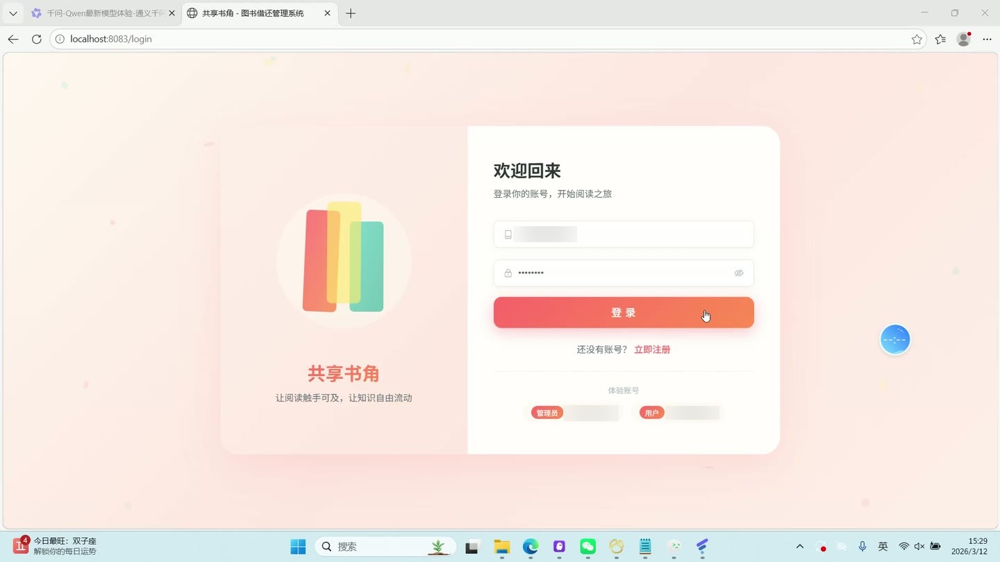
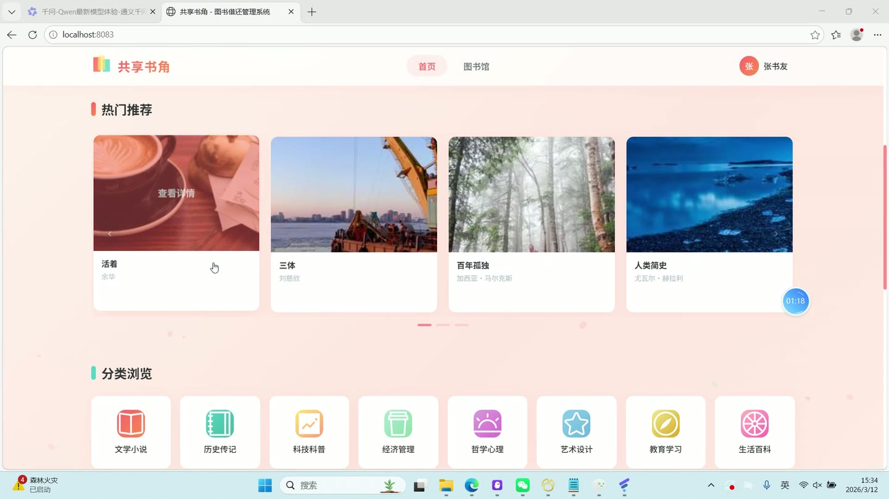
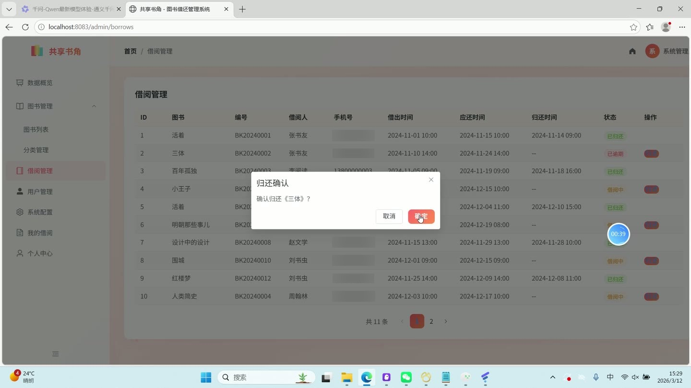
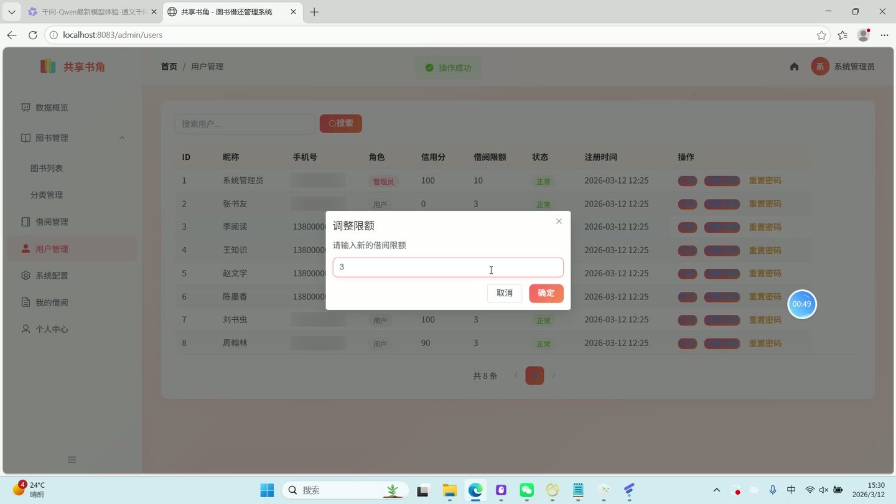
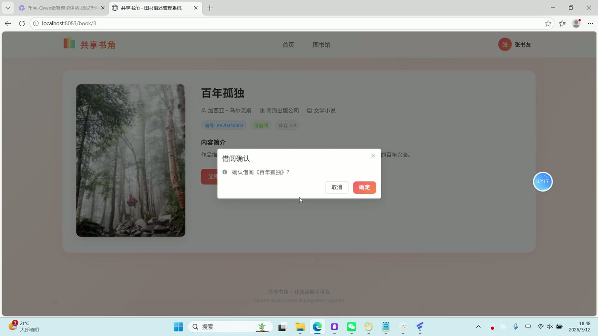

# (附文档)Springboot3+Vue3+MySQL 图书借还管理系统

**技术栈**：Springboot3、Vue3、MySQL

### 系统简介

共享书角图书借还管理系统是一套基于 Spring Boot 3 + Vue 3 前后端分离架构的图书借阅管理平台。系统支持普通用户在线浏览图书、借阅与归还，管理员后台管理图书、分类、借阅记录、用户信息及系统配置，并支持图书数据的 Excel 批量导入与导出。
 
### 核心功能
 
### 普通用户端

 
- 手机号/密码登录与注册（支持表单校验与 JWT 身份认证） 
- 浏览图书列表（支持按关键词搜索、按分类筛选，分页展示） 
- 查看图书详情（展示封面、作者、出版社、分类、库存、简介等信息） 
- 借阅图书（点击“借阅”按钮，系统校验信用分、借阅上限、库存后生成借阅记录） 
- 查看我的借阅记录（分页展示当前用户的历史借阅与当前借阅，含图书名称、编号、借出/应还/归还时间、状态） 
- 在线归还图书（在借阅记录中点击“归还”按钮，系统自动计算逾期天数并扣除信用分） 
- 个人资料编辑（修改昵称、头像等个人信息） 
- 修改密码（输入原密码与新密码完成密码更新） 
- 查看首页统计（总图书数、总用户数、当前借阅数等概览数据） 
- 查看图书分类列表（用于前端筛选与导航）
 
### 管理员端

 
- 仪表盘总览（展示总图书数、总用户数、借阅中数量、逾期数量、分类统计、借阅趋势、热门图书排行） 
- 图书管理：查看图书列表（支持按关键词/分类/状态筛选，分页展示封面、编号、书名、作者、分类、库存、状态） 
- 添加/编辑图书（填写编号、书名、作者、出版社、分类、封面上传、库存数量、状态、简介、备注） 
- 删除图书（确认弹窗后逻辑删除） 
- 图书分类管理：查看分类列表（含 ID、名称、排序值） 
- 添加/编辑/删除分类（支持设置排序顺序） 
- 借阅记录管理：查看所有借阅列表（展示图书名称、编号、借阅人、手机号、借出/应还/归还时间、状态） 
- 管理员手动归还图书（对借阅中或逾期的记录执行归还操作） 
- 用户管理：查看用户列表（支持按昵称/手机号搜索，分页展示） 
- 修改用户状态（启用/冻结账号） 
- 修改用户信用分（范围 0-100） 
- 修改用户借阅上限（可借阅图书的最大数量） 
- 重置用户密码（默认重置为 123456） 
- 系统配置管理：查看与编辑系统参数（如最低信用分限制、借阅天数、逾期每日扣分等） 
- Excel 导入图书（上传 .xlsx 文件批量新增图书，自动校验编号与必填字段） 
- Excel 导出图书（将当前全部图书列表导出为 .xlsx 文件）
 
### 技术栈

 后端框架Spring Boot 3.x ORMMyBatis-Plus 3.5.x 权限认证JWT（jjwt） 密码加密BCrypt（Spring Security Crypto） 前端框架Vue 3（Composition API + script setup） 状态管理Pinia 路由Vue Router 4（History 模式） UI 组件库Element Plus 构建工具Vite 数据库MySQL（InnoDB） Excel 处理EasyExcel 文件上传Spring MultipartFile + 本地存储
 
### 交付内容

 
- 后端完整源码 
- 前端完整源码 
- 数据库初始化脚本 
- 万字文档

## 界面展示

---

## 获取完整源码 + 万字文档

本仓库为项目介绍页。**完整前后端源码、数据库初始化脚本、万字项目文档**，请加微信 `kangkangcode`，或访问 [codekk.top](http://codekk.top) 获取。

可作课程设计 / 毕业设计参考，支持远程部署调试。